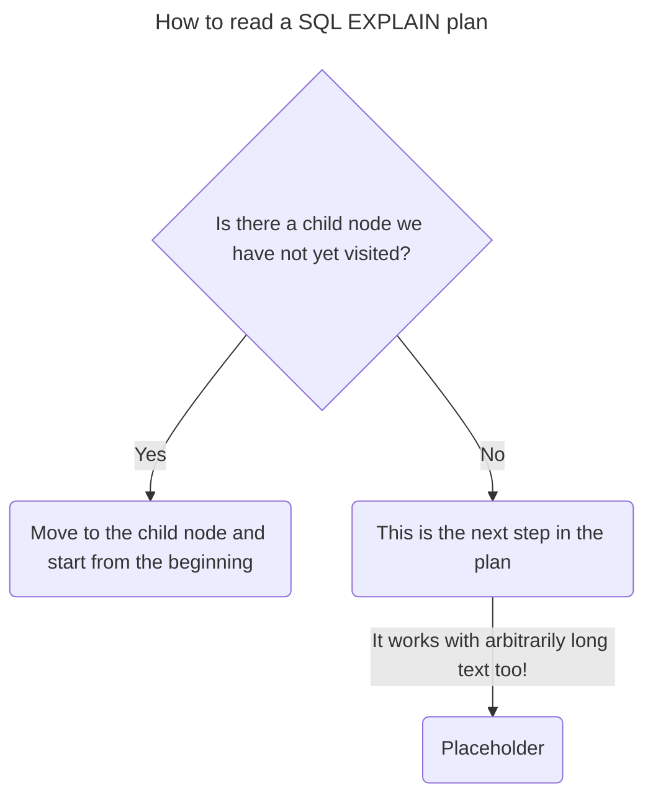
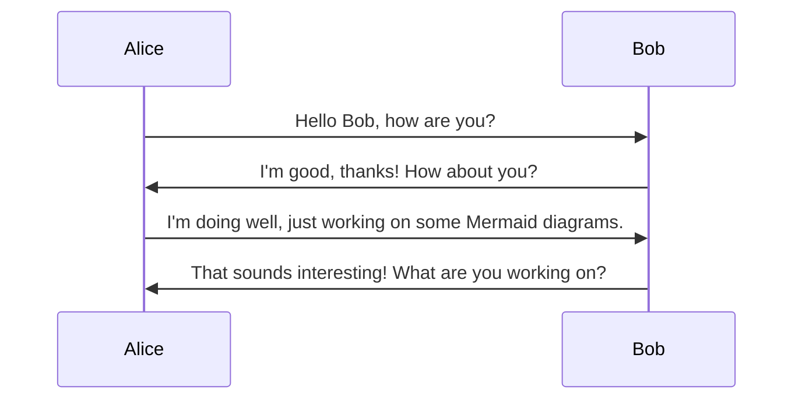
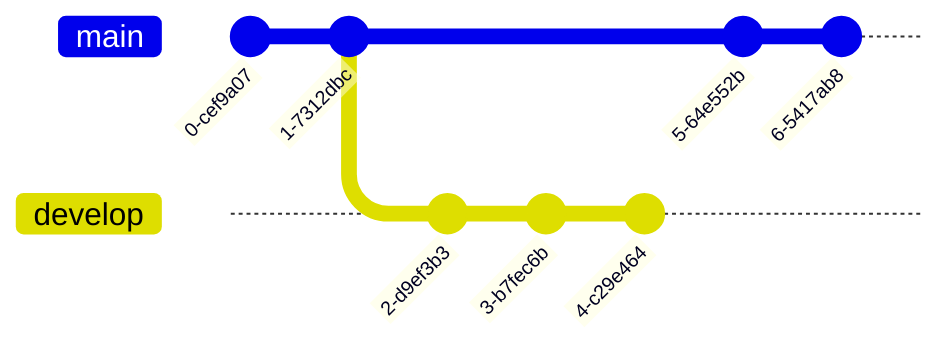
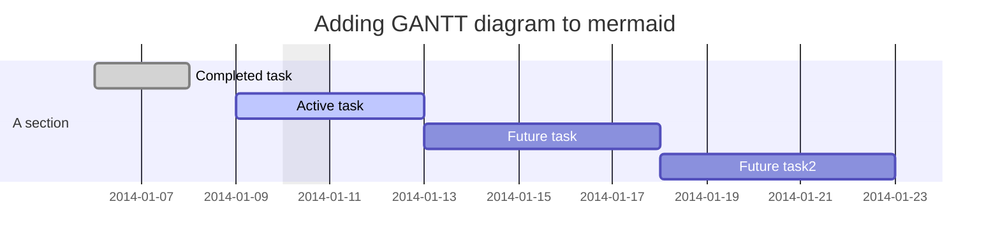
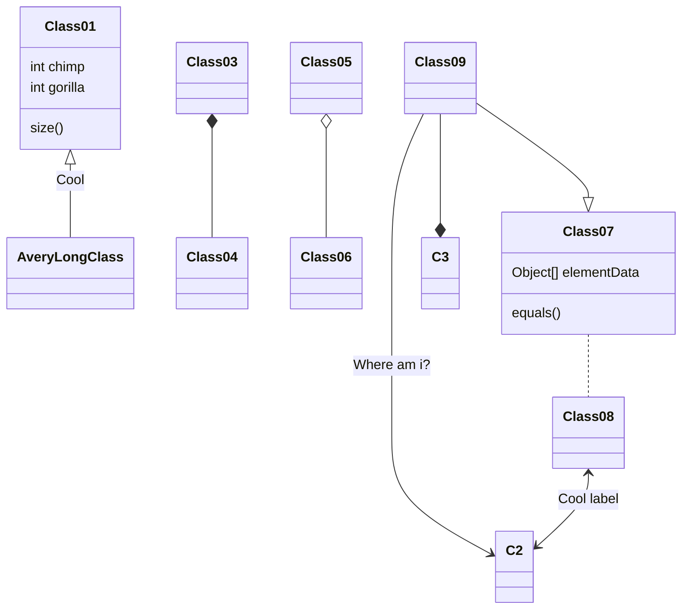
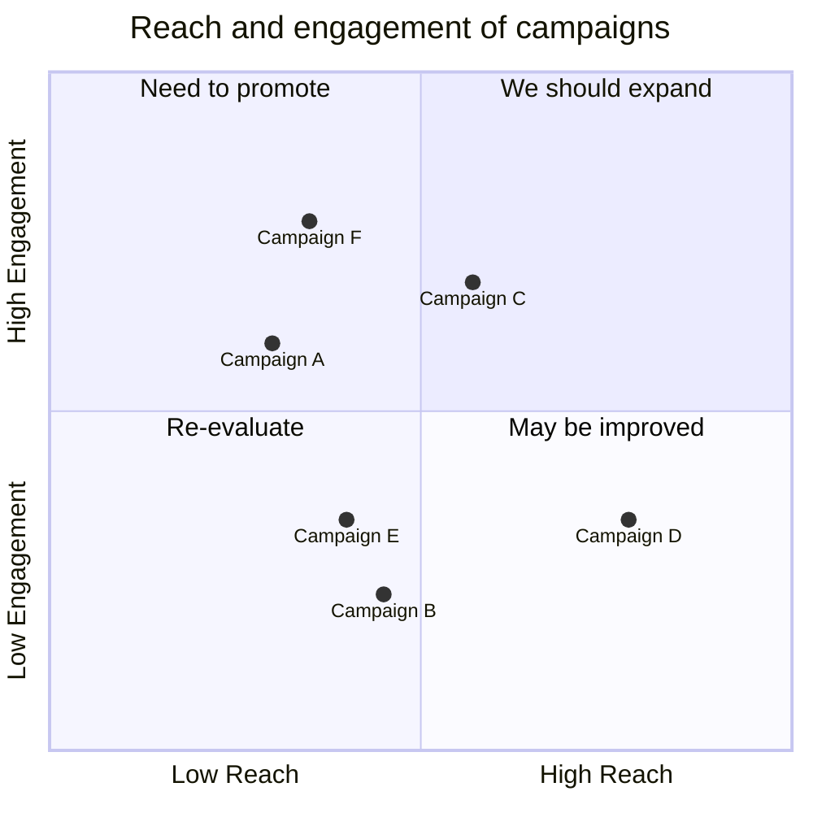

export const metadata = {
  title: "Making edge labels readable in Mermaid diagrams",
  excerpt:
    "A simple set of CSS styles to make the edge labels in mermaid diagrams look great.",
  date: "2025-05-15",
  tags: ["mermaidjs", "css", "diagrams", "diagrams-as-code"],
  slug: "how-to-style-mermaid-edge-labels",
};

import { Byline } from "@/components/atoms/Byline/Byline";

# Making edge labels readable in Mermaid diagrams

<Byline {...metadata} />

Recently, I've been working to improve the way this website renders [Mermaid diagrams](https://mermaid.js.org/). There are two things that I wanted to improve:

1. Edge labels have no horizontal padding, which makes them hard to read.
2. Switching between light and dark themes on the site doesn't trigger a re-render of the diagrams, so they don't change colors when the theme changes. (Post incoming ✍️)

These problems bugged me enough that I decided to document how I solved them. In this post, we'll tackle the first problem: styling edge labels in Mermaid diagrams.

## The problem

Mermaid diagrams are rendered using SVG, which means that they are styled using CSS. However, the default styles for edge labels in Mermaid diagrams don't include any horizontal padding. This makes them look cramped and hard to read.

I mean, look at this diagram I'm building about reading SQL EXPLAIN plans:


The nodes in the diagram (the big off-white boxes) look so great, but look at the edge labels! They're a single pixel away from running off the edge of the label!

Booooooooo, default styles 👎

## Better styles

Turns out, after some tinkering with the CSS in the developer tools, the solution is pretty simple. We just need one set of rules in our `globals.css` file:

```css
/* 1. Target the foreignObject (the parent) */
foreignObject {
  display: flex;
  align-items: center;
  justify-content: center;

  /* 2. All items have a foreignObject */
  /* We only care about edgeLabels */
  &:has(.edgeLabel) {
    background-color: transparent;

    /* 3. Make the label transparent because, by default, */
    /* it has a translucent background color */
    .edgeLabel,
    .labelBkg {
      background-color: transparent !important;
    }

    /* 4. Now, changes to the paragraph */
    /* directly impact what you see */
    p {
      margin-inline: auto !important;
      max-width: max-content;
      border-radius: 8px;
      padding: 0 0.75rem;
    }
  }
}
```

This CSS does a few things:

- It makes the `foreignObject` display as a flex container, which allows us to center the edge labels while forcing the `foreignObject` to take up the max width.
- It targets the `foreignObject`, `.edgeLabel`, and `labelBkg` elements that contain an edge label and makes them transparent. This prevents the default translucent background color from showing up.
- It applies some styles to the `p` element inside the edge label, including horizontal padding and a border radius.

And with just those few lines of CSS, our diagram looks much better ✨:



Now the edge labels are much more readable, and fit the general style of the rest of the diagram. The best part is that you can easily adjust the styles in the paragraph to customize the look.










