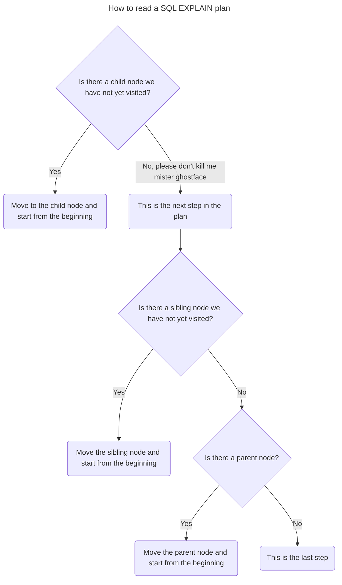

export const metadata = {
  title: "How to read a SQL EXPLAIN plan",
  date: "2025-05-10",
  tags: ["sql", "explain", "performance"],
  slug: "how-to-read-a-sql-explain-plan",
};

# Hi

```mermaid
---
title: How to read a SQL EXPLAIN plan
---
flowchart TD
  A{"Is there a child node we have not yet visited?"}
  A -->|Yes| B("Move to the child node and start from the beginning")
  A -->|No, please don't kill me mister ghostface| C("This is the next step in the plan")
  C --> D{"Is there a sibling node we have not yet visited?"}
  D -->|Yes| E("Move the sibling node and start from the beginning")
  D -->|No| F{"Is there a parent node?"}
  F -->|Yes| G("Move the parent node and start from the beginning")
  F -->|No| H("This is the last step")
```
