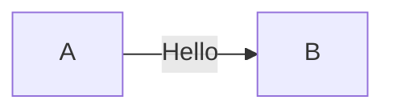

# Hello

Welcome in! Have a seat!

## Subsection

Here's a subsection. I'm using **bold** and _italic_ for ~emphatics~ emphasis.



```typescript
const foobar = () => {
  return 1 + 2;
};
```

```python
x = 12
y = "123"
print(x + y)
```
